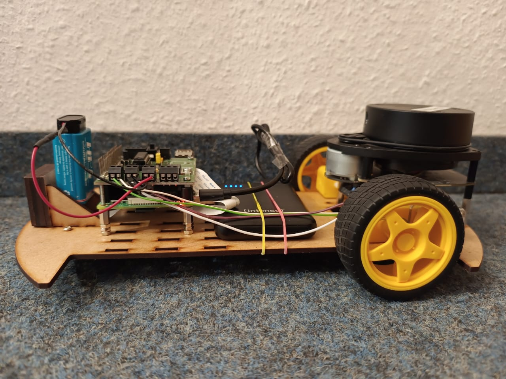

# 🤖 Robot Car Racing Competition 🚗💨

## 🚀 Overview
The **Robot Car Racing Competition** is part of the Master's program in **Mechatronics and Embedded Systems** at **Ravensburg-Weingarten University of Applied Sciences (RWU)**. Guided by **Mr. Tobias Niedermaier**, this project brings together the power of **robotics**, **computer vision**, and **sensor integration** to design an autonomous robot car capable of solving a series of exciting tasks!

The challenge: Build a robot that can race through obstacles, detect colors, follow lines, and even recognize special markers — all while demonstrating the power of modern embedded systems!



---

### ✨ Authors
- **Vardhan Mistry**
- **Rajveersinh Suratiya**
- **Hardik Rathwa**

---

## 📂 Repository Structure

This repository is organized into 4 main tasks. Each task contains the implementation, visual media, and a README explaining the specific solution.

```plaintext
Robot-Car-Racing-Competition/
│
├── Task1_Line_Following/
│   ├── task1_line_following.py
│   ├── README.md
│   ├── videos/
│   └── images/
│
├── Task2_obstacle_avoidance/
│   ├── task2_obstacle_avoidance.py
│   ├── README.md
│   ├── videos/
│   └── images/
│
├── Task3_Color_Cube_Detection/
│   ├── task3_color_cube_detection.py
│   ├── README.md
│   ├── videos/
│   └── images/
│
├── Task4_ArUco_Cube_Detection/
│   ├── task4_aruco_cube_detection.py
│   ├── README.md
│   ├── videos/
│   └── images/
│
├── README.md  (This File)
└── Line.pdf  (Line layout reference)
```

---

### 🛠️ **Common Hardware Requirements**

- **Raspberry Pi 4**  
- **Pi Camera** or compatible USB camera  
- **RPLidar** sensor 
- **Motor Driver** (e.g., L298N)  
- **DC Motors** and chassis  
- **Power Supply** and wiring  

https://github.com/user-attachments/assets/0271f348-8bbe-43eb-9ca3-3706eaa3ae32

---

### 💻 **Common Software Requirements**

- **Python 3.x**  
- **OpenCV** library  
- **RPi.GPIO** library  
- **Adafruit RPLidar** library  

---

## 🏁 **General Description of Tasks**

### 🚗 **Task 1: Line Following**
The robot uses a camera to follow a **line** created using sheets of paper (see `Line.pdf`). It detects the line in real-time and adjusts its movement to stay on track. Fine-tuned thresholds ensure optimal performance, especially for navigating **H216**!

---

### 🛑 **Task 2: LiDAR-Based Stopping (Obstacle Avoidance)**
Utilizing a **LiDAR sensor**, the robot detects obstacles and automatically stops **20 cm** before hitting them. This feature works seamlessly while the robot is following the line from Task 1!

---

### 🎨 **Task 3: Color Cube Detection**
The robot can **detect and approach cubes**:
- Green cubes: Stop at **20 cm**
- Red cubes: Stop at **40 cm**

If no cubes are visible, the robot remains stationary. If both cubes are visible, the robot heads toward the closer one!

---

### 🟩🟥 **Task 4: ArUco Marker Cube Detection**
The robot detects **ArUco marker cubes** (6x6 ID 0 and ID 1) and stops at specific distances:
- **ID 0**: Stop at **20 cm**
- **ID 1**: Stop at **40 cm**

If both markers are visible, the robot targets the closer marker!

---

## 🌐 **Technologies and Tools**

- **Programming Language**: Python  
- **Libraries**: OpenCV, NumPy, RPi.GPIO  
- **Hardware**: Raspberry Pi 4, Pi Camera, LiDAR

---

## 🏃‍♂️ **How to Run the Code**

1. Clone the repository:
   ```bash
   git clone https://github.com/Vardhan1303/Robot-Car-Racing-Competition.git
   cd Robot-Car-Racing-Competition
   ```

2. Navigate to the desired task folder:
   ```bash
   cd Task1_Line_Following
   ```

3. Run the Python script:
   ```bash
   python3 task1_line_following.py
   ```

4. Follow the instructions in the task-specific `README.md` for setup and testing.

---

## 📌 **Notes**
- This code is designed for **Raspberry Pi 4**. Modifications will be needed if using other hardware.
- This project is part of a **learning exercise** for the **ADAS (Advanced Driver-Assistance Systems)** field.
- No redistribution or copying of content for commercial use is allowed. Please contact the authors for permission.

---

## 🏆 **Acknowledgements**
Huge thanks to **Mr. Tobias Niedermaier** for his invaluable guidance and support throughout this project. The course provided amazing learning opportunities in **robotics**, **computer vision**, and **sensor integration**.

---

---

## 📚 References

1. **Kalman Filter**  
   R. E. Kalman. “A New Approach to Linear Filtering and Prediction Problems”. In: Transactions of the ASME-Journal of Basic Engineering 82.1 (1960). Accessed: 03-01-2025, pp. 35–45.
   
2. **Camera Calibration**  
   Z. Zhang. A Flexible New Technique for Camera Calibration. Vol. 22. 11. Accessed: 03-01-2025. IEEE, 2000, pp. 1330–1334.

3. **Digital Image Processing**  
   R. C. Gonzalez and R. E. Woods. “Digital Image Processing”. In: Pearson (2018). ISBN: 978-0133356724, Accessed: 02-01-2025.

4. **Object Distance Estimation**  
   A. M. Olatunde E. E. Idohen and U. A. Umar. “Object distance estimation using a monovision camera”. In: IAES International Journal of Robotics and Automation (IJRA) 12.4 (Dec. 2023). Accessed: 01-01-2025, pp. 325–331. doi: 10.11591/ijra.v12i4.pp325-331.

5. **Adaptive Thresholding**  
   J. Bradley and G. Roth. “Adaptive Thresholding Using the Integral Image”. In: Journal of Graphics Tools 12.2 (2007). Accessed: 15-12-2024, pp. 13–21.

6. **LiDAR-Based Obstacle Detection**  
   R. Palossi, C. Greco, and L. Benini. “A Sub-10 mW Real-Time Implementation for LiDAR-Based Obstacle Detection on Autonomous Robots”. In: IEEE Sensors Journal 19.7 (2019). Accessed: 15-12-2024, pp. 2694–2704.

7. **Feedback Systems**  
   K. ˚ Astr¨ om and R. M. Murray. Feedback Systems: An Introduction for Scientists and Engineers. Accessed: 15-12-2024. Princeton University Press, 2008.

8. **OpenCV Documentation**  
   OpenCV. OpenCV Documentation. Accessed: 01-01-2025. https://docs.opencv.org. 2024.

---
⭐ If you like this project, give it a star! 🌟