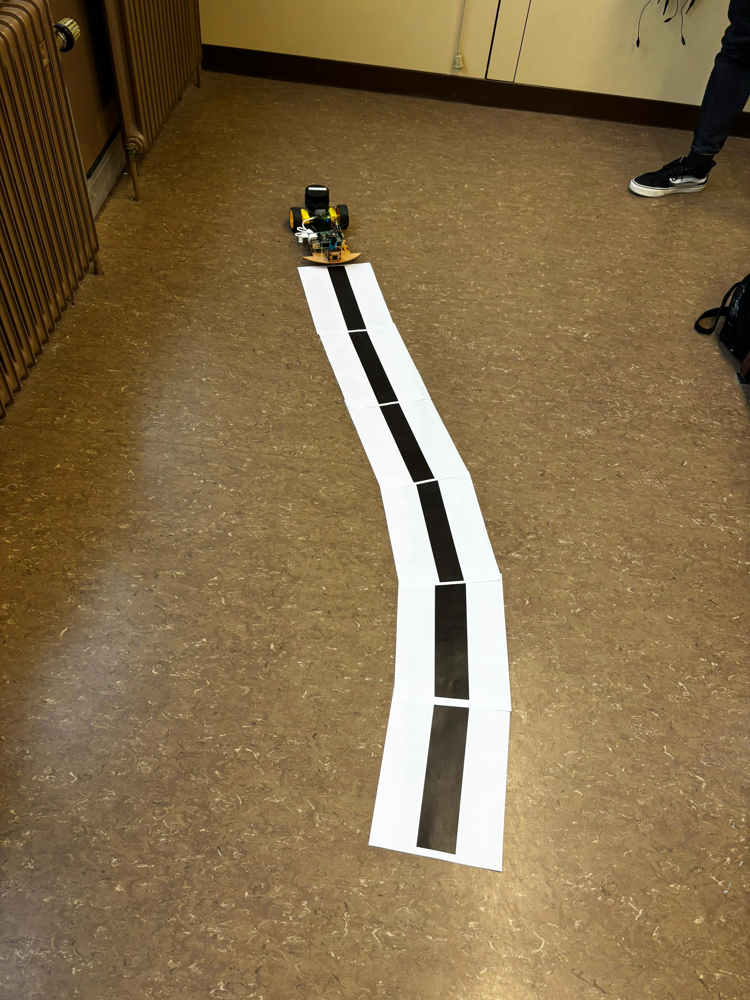

# 🚗 Line-Following Robot with Raspberry Pi and OpenCV

This project showcases a line-following robot powered by a Raspberry Pi, a camera, and OpenCV. The robot uses real-time video feed to detect a line and adjusts its motor speeds dynamically to stay on track. This is an essential task for autonomous navigation systems.

---

## 📋 Table of Contents

- [Project Overview](#project-overview)
- [Features](#features)
- [Setup and Execution](#setup-and-execution)
- [How It Works](#how-it-works)
- [Results](#results)
---

## 📝 Project Overview

The robot leverages:
- **Camera Feed**: To capture the environment and detect the line.
- **Motor Control**: To adjust speeds for precise navigation.
- **Line-Following Logic**: Using OpenCV's image processing for line detection and feedback control.

---

## 🌟 Features

- Real-time line detection and tracking.
- Dynamic motor speed adjustments using error-correction logic.
- Responsive behavior for maintaining the track.
- Customizable parameters for fine-tuning.

---

## ⚙️ How It Works

1. **Line Detection**:
   - Captures live video feed from the camera.
   - Converts the image to grayscale and applies binary thresholding.
   - **Threshold value**: `60` (modifiable in the code).
   - Identifies contours in the binary image to detect the line.

2. **Error Correction**:
   - Calculates deviation of the line's center from the frame's midpoint using moments.
   - Adjusts motor speeds dynamically using proportional control.
   - **Proportional gain (`Kp`)**: `0.035` (modifiable in the code).

3. **Motor Control**:
   - GPIO controls for motor directions.
   - PWM signals adjust motor speeds for smooth navigation.

## 🎥 Results

### Video Demonstration

https://github.com/user-attachments/assets/90679093-3f74-4f93-aafb-94e851244fa7

### Sample Images

#### Line Detection:

#### Robot Following the Line:

---

## 📄 License

This project is licensed under the MIT License. See the `LICENSE` file for details.

---

💡 **Pro Tip**: Modify the PID constants (`Kp`) and threshold parameters to adapt the robot to different lighting conditions or line widths.
