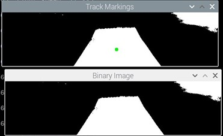

# Task 1: Line Following

## Description
This task involves programming the robot to follow a line created using sheets of paper (as shown in `Line.pdf`). The robot uses a camera to detect the line and adjusts its movement to stay on track.

## Algorithm Overview
1. Capture live video feed from the camera.
2. Apply color or edge detection to identify the line.
3. Determine the deviation of the line from the center and adjust motor speed/direction accordingly.
4. Fine-tuned thresholds ensure stability and accuracy in the H216 environment.

## Hardware and Tools
- Raspberry Pi 4
- Camera
- Python (OpenCV)

## How to Run
1. Place the line pattern (from `Line.pdf`) on the floor.
2. Navigate to the folder:
   ```bash
   cd Task1_Line_Following
    ```
3. Run the script:
   ```bash
   python3 task1_line_following.py
    ```
4. Observe the robot as it follows the line.

## Performance

### Video

[Click here to watch the performance](https://github.com/user-attachments/assets/90679093-3f74-4f93-aafb-94e851244fa7)
<video width="700" controls>
  <source src="https://github.com/user-attachments/assets/90679093-3f74-4f93-aafb-94e851244fa7" type="video/mp4">
  Your browser does not support the video tag.
</video>

### Images

- **Robot Following the Line**

