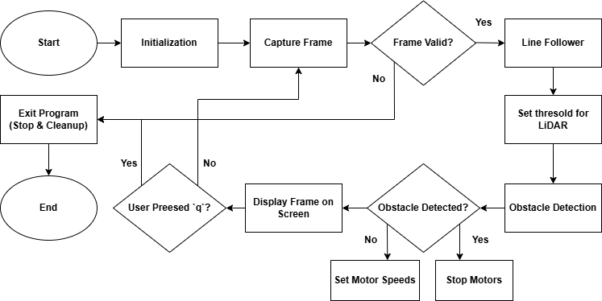

### 🚗 Obstacle-Avoiding Line-Following Robot with Raspberry Pi

This project combines line-following and obstacle detection using a Raspberry Pi, a camera, and an RPLidar sensor. The robot follows a line while dynamically stopping when obstacles are detected within 20 cm. It's a practical implementation of autonomous navigation.

---

### 📋 Table of Contents

- [Project Overview](#project-overview)  
- [Features](#features)  
- [Setup and Execution](#setup-and-execution)  
- [How It Works](#how-it-works)  
- [Results](#results)  
- [License](#license)  

---

### 📝 Project Overview

The robot integrates:  
- **Line-Following**: Using a camera and OpenCV for line detection.  
- **Obstacle Detection**: Using an RPLidar sensor to detect obstacles and stop the robot if an object is within 20 cm.  
- **Motor Control**: Adjusts motor speeds dynamically for smooth navigation.  

---

### 🌟 Features

- Real-time line detection and following.  
- Obstacle detection with LiDAR for safer navigation.  
- Adaptive motor speed control using proportional feedback.  
- Multitasking capabilities with threading for line following and obstacle detection.  

---

### 🚀 Setup

####  **Test**

Place the robot on a line path. Ensure an obstacle (e.g., a wall or object) is placed at least 20 cm in front to test the stopping functionality.  

---

### ⚙️ How It Works

#### **Line Detection**
- Captures live video feed from the camera.  
- Converts the image to grayscale and applies binary thresholding.  
- **Threshold value**: `60` (modifiable in the code).  
- Detects contours in the binary image to identify the line and calculate the error.  

#### **Obstacle Detection**
- LiDAR continuously scans the surroundings.  
- Calculates the minimum distance to obstacles in the front, left, and right directions.  
- Stops the robot if an obstacle is detected within **20 cm** in front.  

#### **Motor Control**
- Dynamically adjusts motor speeds using a proportional feedback system based on the line error.  
- Uses GPIO pins and PWM signals to control motor directions and speeds.  

---

### 🎥 Results

#### **Video Demonstration**  
https://github.com/user-attachments/assets/fe28e438-9fb0-4d97-bebc-e88871e27043

## 🔄 Flowchart

To better understand the flow of the robot's logic, refer to the flowchart below:

  

---

### 📄 License

This project is licensed under the MIT License. See the `LICENSE` file for details.  

---

💡 **Pro Tip**: Fine-tune the LiDAR angle ranges and proportional control constants (`Kp`) for optimal performance in different environments.  
