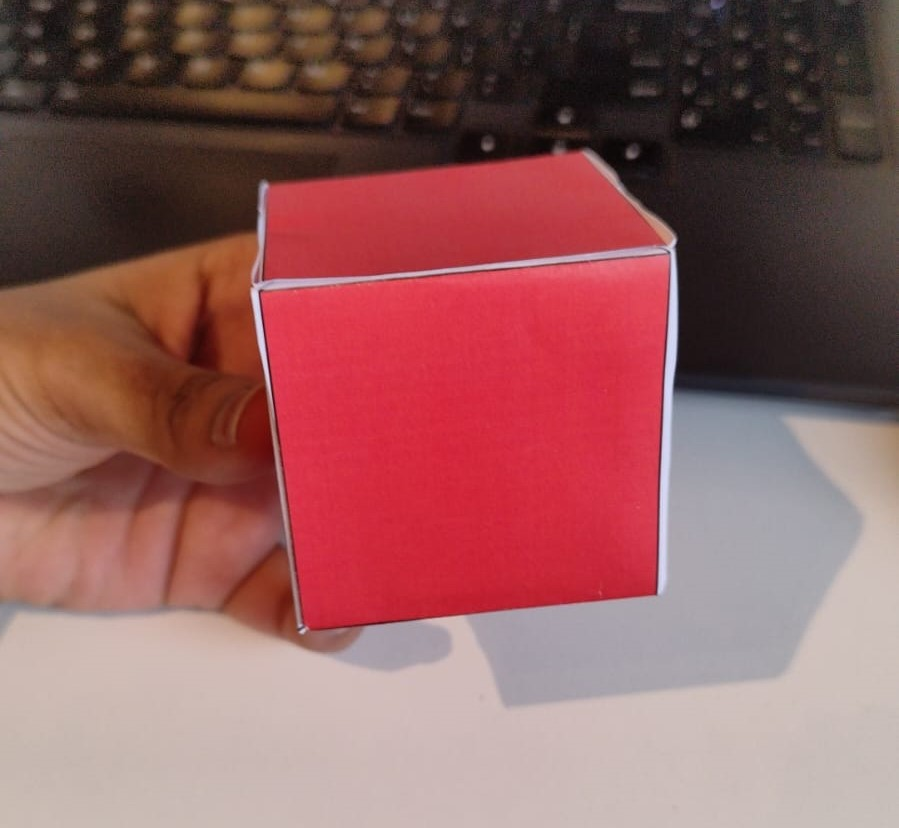

# 🟥🟩 Cube-Tracking Robot with Raspberry Pi

This project involves a Raspberry Pi-powered robot capable of identifying, tracking, and stopping at red and green cubes. The robot uses a camera for vision, GPIO for motor control, and OpenCV for image processing. It demonstrates color-based object tracking and dynamic distance-based stopping behavior.

---

## 📋 Table of Contents
- [Overview](#overview)  
- [Features](#features)  
- [Setup and Execution](#setup-and-execution)  
- [How It Works](#how-it-works)  
- [Results](#results)  
- [License](#license)  

---

## 📝 Overview

The robot is programmed to:
1. Detect red and green cubes using a camera.
2. Move toward the cube that is closest.
3. Stop **40 cm** in front of a red cube and **20 cm** in front of a green cube.
4. Remain stationary when no cube is visible.

---

## 🌟 Features

- Real-time detection of red and green cubes using OpenCV.
- Distance estimation from the cube based on its area in the frame.
- Prioritizes movement toward the closest cube when both are visible.
- Stops dynamically at predefined distances based on cube color.
- Modular and reusable motor control functions.

---

## 🚀 Setup and Execution

1. **Hardware Assembly**: Connect the motors, camera, and motor driver to the Raspberry Pi.
2. **Clone the Repository**
3. **Run the Script**
4. **Test the Robot**:  
   - Place the red and green cubes at various distances.
   - Observe the robot's ability to move toward the cubes and stop at the correct distance.

---

## 🔄 Flowchart

To better understand the flow of the robot's logic, refer to the flowchart below:

  

## ⚙️ How It Works

### **Cube Detection**
- **Color Filtering**: Converts the camera feed to HSV and applies color masks for red and green.
- **Contour Detection**: Identifies contours in the filtered image to locate the cubes.
- **Distance Estimation**: Calculates distance based on the area of the cube's contour using:

Distance = (Focal Length × Known Size) / √(Contour Area)

### Sample Images

#### Red Cube:

#### Robot detecting and showing distance:

### **Motor Control**
- **Forward and Backward Movement**: Uses PWM signals to control motor speed and direction.
- **Proportional Feedback**: Adjusts motor speeds to correct lateral deviations for accurate tracking.

### **Decision Logic**
- Stops at **20 cm** for green cubes and **40 cm** for red cubes.
- Prioritizes the closer cube if both are visible.

---

## 🎥 Results

### **Video Demonstration**

#### Working of algorithm in Raspberry pi and robot is stopping at 20 cm for green cube
[Working of algorithm in Raspberry pi and robot is stopping at 20 cm for green cube!](https://github.com/user-attachments/assets/3814c0a8-199d-4a54-a0aa-03248634928b)

#### Red Cube stopping at approximately 40 cm
[Red Cube stopping at approximately 40 cm](https://github.com/user-attachments/assets/51b9ab9b-85e7-4e0d-b187-7f8b5028f39e)

#### Green Cube stopping at approximately 25 cm
[Green Cube stopping at approximately 25 cm](https://github.com/user-attachments/assets/e8f8f1fb-b622-4b52-bfdc-5e576bc7b2b7)
---

## 📄 License

This project is licensed under the MIT License. See the `LICENSE` file for details.

---

💡 **Pro Tip**: Fine-tune the HSV range for your environment's lighting conditions and adjust motor speed constants for smoother navigation.