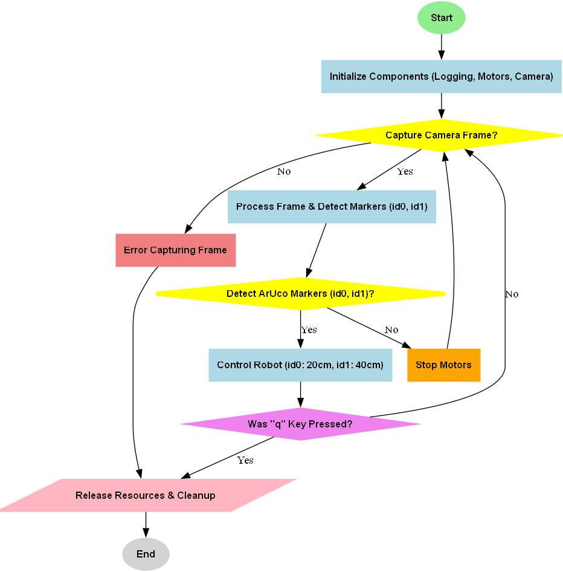

# 🟩 ArUco Marker-based Distance Control for Cube-Tracking Robot

This project uses a Raspberry Pi-based robot to detect and approach two cubes equipped with ArUco markers (ID 0 and ID 1). The robot is capable of stopping at a predefined distance (20 cm for ID 0 and 40 cm for ID 1) based on the detected marker. If both cubes are visible, the robot prioritizes the closer cube.

---

## 📋 Table of Contents
- [Overview](#overview)  
- [Features](#features)  
- [Setup and Execution](#setup-and-execution)  
- [Flowchart](#flowchart)  
- [How It Works](#how-it-works)  
- [Distance Calculation](#distance-calculation)  
- [Motor Control Logic](#motor-control-logic)  
- [Results](#results)  
- [License](#license)  

---

## 📝 Overview

This project involves the following:
1. Detecting two cubes with ArUco markers (ID 0 and ID 1) using a Raspberry Pi camera.
2. Driving the robot towards the detected cubes and stopping at a fixed distance: **20 cm** for the cube with ID 0 and **40 cm** for the cube with ID 1.
3. When both cubes are detected, the robot chooses the closer one to approach.

The robot uses OpenCV to detect the ArUco markers, and a Kalman filter is applied to improve the estimation of lateral deviations for more stable movement.

---

## 🌟 Features

- **ArUco Marker Detection**: Detects 6x6 ArUco markers with IDs 0 and 1.
- **Distance Estimation**: Calculates the distance to the marker and drives accordingly.
- **Kalman Filter for Stability**: Uses a Kalman filter to smooth out the robot’s movements based on lateral deviations.
- **Priority to Closer Cube**: Chooses the closer cube if both are visible.
- **Motor Control**: The robot stops at a predefined distance (20 cm for ID 0 and 40 cm for ID 1).
- **Logging and Debugging**: Provides logs for debugging and status updates.

---

## 🚀 Setup and Execution

### 1. **Hardware Setup**
- **Raspberry Pi**: Ensure your Raspberry Pi has the GPIO library and a camera module connected.
- **Motor Driver**: Connect the motor driver (such as L298N) to the Raspberry Pi's GPIO pins.
- **ArUco Markers**: Print the provided ArUco markers (ID 0 and ID 1) and place them at different locations.
  
### 2. **Clone the Repository**

### 3. **Install Dependencies**
Make sure you have OpenCV and other required libraries installed.

### 4. **Run the Script**
To start the robot, run the main script:

### 5. **Test the Robot**
- Place the cubes (ID 0 and ID 1) at various distances.
- Observe the robot driving towards the cubes and stopping at the correct distances.

---

## 🔄 Flowchart

Here’s the flowchart illustrating the robot's behavior:



---

## ⚙️ How It Works

### **ArUco Marker Detection**
The robot uses OpenCV's `aruco.detectMarkers()` function to locate ArUco markers within the camera frame. Once markers are detected, the robot estimates their 3D pose using `aruco.estimatePoseSingleMarkers()`, which returns translation and rotation vectors.

### **Camera Calibration and Intrinsic Parameters**
The robot's ability to accurately calculate distances to the ArUco markers relies on the intrinsic camera parameters obtained from a previous calibration process. The following camera matrix and distortion coefficients are used:

```python
camera_matrix = np.array([
    [640.0, 0.0, 320],
    [0.0, 480, 240],
    [0.0, 0.0, 1.0]
])

dist_coeffs = np.array([0.47355397300107105, -1.5144140141504312, -0.04925321388896157, -0.0005953778540672351, -3.6450646185498092])
```

These values were obtained through a **camera calibration** process, which involves taking several images of a checkerboard pattern and using OpenCV functions to estimate the intrinsic parameters. This allows the robot to correctly interpret the distances between itself and the markers in real-world units.

For more information on the calibration process, please refer to the **References** section in common README file.

### **Kalman Filter for Stability**
A Kalman filter is used to track the lateral deviation of the detected markers. This helps to smooth out erratic robot movements and keeps the robot stable when correcting its trajectory.

```python
class KalmanFilter:
    def _init_(self, process_variance, measurement_variance, estimation_error, initial_estimate):
        self.process_variance = process_variance
        self.measurement_variance = measurement_variance
        self.estimation_error = estimation_error
        self.estimate = initial_estimate

    def update(self, measurement):
        self.estimation_error += self.process_variance
        kalman_gain = self.estimation_error / (self.estimation_error + self.measurement_variance)
        self.estimate += kalman_gain * (measurement - self.estimate)
        self.estimation_error *= (1 - kalman_gain)
        return self.estimate
```

### **Motor Control**
The robot’s motors are controlled using PWM signals. The `control_robot()` function adjusts the motor speeds based on the distance to the marker and the lateral deviation, which helps to avoid drifting off course. The robot stops once the desired distance is reached.

```python
def control_robot(distance, desired_distance, lateral_deviation):
    if distance > desired_distance + 5:
        if lateral_deviation > 10:
            left_motor_forward(0.35)
            right_motor_forward(0.25)
        elif lateral_deviation < -10:
            left_motor_forward(0.25)
            right_motor_forward(0.35)
        else:
            left_motor_forward(0.35)
            right_motor_forward(0.3)
    else:
        stop_motors()
```

---

## 📏 Distance Calculation

The robot estimates the distance to each ArUco marker using the translation vector (`tvec`) obtained from the `estimatePoseSingleMarkers()` function:

```python
def calculate_distance(tvec):
    return int(tvec[0][0][2] * 100)  # Distance in centimeters
```

Here, `tvec[0][0][2]` represents the distance along the z-axis (depth) of the marker relative to the camera. The multiplication by 100 converts this value to centimeters.

---

## 🎥 Results

Once the setup is complete, you will observe the robot's behavior:

- The robot moves toward the detected ArUco marker.
- When the robot is within 20 cm of the marker with ID 0, it stops.
- Similarly, it stops at 40 cm for the marker with ID 1.
- If both markers are visible, the robot approaches the closest one.

### **Example Output**
- **Green Cube (ID 0)**: Stops at approximately 20 cm.
- **Red Cube (ID 1)**: Stops at approximately 40 cm.
- **Both cubes visible**: The robot approaches the closest one.

---

## 📄 License

This project is licensed under the MIT License. See the `LICENSE` file for details.

---

💡 **Pro Tip**: Adjust the speed and PID constants for smoother movement and finer control. Fine-tune the Kalman filter parameters for better estimation of lateral deviations.